# Linear Regression

We will use the SAT data for 162 students which includes their verbal and math scores. We will model math from verbal. Recall that the linear model can be expressed as:

$$y = mx + b$$

Or alternatively as:

$$y = {b}_{1}x + {b}_{0}$$

Where m (or $b_1$) is the slope and b (or $b_0$) is the intercept. Therefore, we wish to model:

$$SAT_{math} = {b}_{1}SAT_{verbal} + {b}_{0}$$

To begin, we read in the CSV file and convert the `Verbal` and `Math` columns to integers. The data file uses `.` (i.e. a period) to denote missing values. The `as.integer` function will automatically convert those to `NA` (the indicator for a missing value in R). Finally, we use the `complete.cases` eliminate any rows with any missing values.


```r
sat <- read.csv("../Data/Textbook/Chapter_7/SAT_scores.csv", stringsAsFactors = FALSE)
names(sat) <- c("Verbal", "Math", "Sex")
sat$Verbal <- as.integer(sat$Verbal)
sat$Math <- as.integer(sat$Math)
sat <- sat[complete.cases(sat), ]
```


The first step is to draw a scatter plot. We see that the relationship appears to be fairly linear.


```r
ggplot(sat, aes(x=Verbal, y=Math)) + geom_point(color='black')
```

 


Next, we will calculate the means and standard deviations.

```r
(verbalMean <- mean(sat$Verbal))
```

```
[1] 596
```

```r
(mathMean <- mean(sat$Math))
```

```
[1] 612
```

```r
(verbalSD <- sd(sat$Verbal))
```

```
[1] 99.5
```

```r
(mathSD <- sd(sat$Math))
```

```
[1] 98.1
```

```r
(n <- nrow(sat))
```

```
[1] 162
```


Calcualte z-scores (standard scores) for the verbal and math scores.

$$ z=\frac { y-\overline { y }  }{ s } $$


```r
sat$Verbal.z <- (sat$Verbal - verbalMean)/verbalSD
sat$Math.z <- (sat$Math - mathMean)/mathSD
head(sat)
```

```
  Verbal Math Sex Verbal.z  Math.z
1    450  450   F  -1.4700 -1.6518
2    640  540   F   0.4391 -0.7347
3    590  570   M  -0.0633 -0.4290
4    400  400   M  -1.9724 -2.1613
5    600  590   M   0.0372 -0.2252
6    610  610   M   0.1377 -0.0214
```


Scatter plot of z-scores. Note that the pattern is the same but the scales on the x- and y-axes are different.

```r
ggplot(sat, aes(x=Verbal.z, y=Math.z)) + geom_point(color='black')
```

 


Calculate the correlation manually using the z-score formula:

$$ r=\frac { \sum { { z }_{ x }{ z }_{ y } }  }{ n-1 } $$


```r
r <- sum(sat$Verbal.z * sat$Math.z)/(n - 1)
r
```

```
[1] 0.685
```


Or the `cor` function in R is probably simplier. 

```r
cor(sat$Verbal, sat$Math)
```

```
[1] 0.685
```


And to show that the units don't matter, calculate the correlation with the z-scores.

```r
cor(sat$Verbal.z, sat$Math.z)
```

```
[1] 0.685
```


Calculate the slope.
$$m = r\frac{S_y}{S_x} = r\frac{S_{math}}{S_{verbal}}$$


```r
m <- r * (mathSD/verbalSD)
m
```

```
[1] 0.675
```


Calculate the intercept (recall that the point where the mean of x and mean of y intersect will be on the line of best fit). Therefore,
$$b = \overline{y} - m \overline{x} = \overline{SAT_{math}} - m \overline{SAT_{verbal}}$$


```r
b <- mathMean - m * verbalMean
b
```

```
[1] 210
```


We can now add the regression line to the scatter plot. The vertical and horizontal lines represent the mean Verbal and Math SAT scores, respectively.

```r
ggplot(sat, aes(x=Verbal, y=Math)) + geom_point(color='black') +
	geom_vline(xintercept=verbalMean, color='darkmagenta') +
	geom_hline(yintercept=mathMean, color='darkmagenta') +
	geom_abline(intercept=b, slope=m, color='red', size=2, alpha=.5)
```

 


### Examine the Residuals

To examine the residuals, we first need to calculate the predicted values of y (Math scores in this example).

```r
sat$Math.predicted <- m * sat$Verbal + b
head(sat)
```

```
  Verbal Math Sex Verbal.z  Math.z Math.predicted
1    450  450   F  -1.4700 -1.6518            513
2    640  540   F   0.4391 -0.7347            642
3    590  570   M  -0.0633 -0.4290            608
4    400  400   M  -1.9724 -2.1613            480
5    600  590   M   0.0372 -0.2252            615
6    610  610   M   0.1377 -0.0214            621
```


The residuals are simply the difference between the observed and predicted values.

```r
sat$residual <- sat$Math - sat$Math.predicted
head(sat)
```

```
  Verbal Math Sex Verbal.z  Math.z Math.predicted residual
1    450  450   F  -1.4700 -1.6518            513    -63.3
2    640  540   F   0.4391 -0.7347            642   -101.6
3    590  570   M  -0.0633 -0.4290            608    -37.8
4    400  400   M  -1.9724 -2.1613            480    -79.6
5    600  590   M   0.0372 -0.2252            615    -24.6
6    610  610   M   0.1377 -0.0214            621    -11.3
```


Plot our regression line with lines representing the residuals. The line of best fit minimizes the residuals.

```r
ggplot(sat, aes(x=Verbal, y=Math)) + geom_point(color='black') +
	geom_abline(intercept=b, slope=m, color='red', size=2, alpha=.5) +
	geom_segment(aes(xend=Verbal, yend=Math.predicted, color=abs(residual))) +
	scale_color_gradient(low='white', high='blue')
```

 


To show that $m = r \frac{S_y}{S_x}$ minimizes the sum of squared residuals, this loop will calculate the sum of squared residuals for varying values of r above and below the calculated value.

```r
results <- data.frame(r = seq(r - 0.2, r + 0.2, by = 0.01), m = as.numeric(NA), 
    b = as.numeric(NA), sumsquares = as.numeric(NA))
for (i in 1:nrow(results)) {
    results[i, ]$m <- results[i, ]$r * (mathSD/verbalSD)
    results[i, ]$b <- mathMean - results[i, ]$m * verbalMean
    predicted <- results[i, ]$m * sat$Verbal + results[i, ]$b
    residual <- sat$Math - predicted
    sumsquares <- sum(residual^2)
    results[i, ]$sumsquares <- sum(residual^2)
}
```


Plot the sum of squared residuals for different slopes (i.e. r's). The vertical line corresponds to the r (slope) calcluated above and the horizontal line corresponds the sum of squared residuals for that r. This should have the smallest sum of squared residuals.

```r
ggplot(results, aes(x=r, y=sumsquares)) + geom_point() + 
	geom_vline(xintercept=r, color='blue') +
	geom_hline(yintercept=sum(sat$residual^2), color='magenta')
```

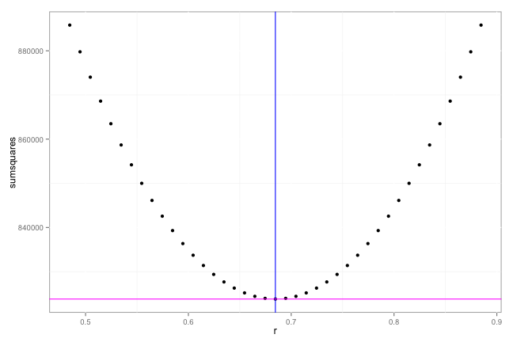 


To exemplify how the residuals change, the following scatter plot picks one of the "bad" models and plot that regression line with the original, best fitting line. Take particular note how the residuals would be less if they ended on the red line (i.e. the better fitting model). This is particularly evident on the far left and far right, but is true across the entire range of values.

```r
b.bad <- results[1, ]$b
m.bad <- results[1, ]$m
sat$predicted.bad <- m.bad * sat$Verbal + b.bad
```


```r
ggplot(sat, aes(x=Verbal, y=Math)) + geom_point(color='black') +
	geom_abline(intercept=b, slope=m, color='red', size=2, alpha=.2) +
	geom_abline(intercept=b.bad, slope=m.bad, color='black', size=2, alpha=.5) +
	geom_segment(aes(xend=Verbal, yend=predicted.bad), alpha=.5, color='blue')
```

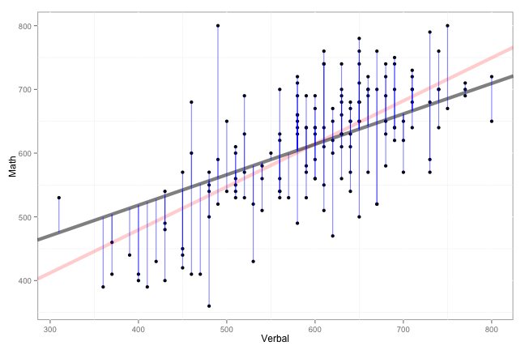 


Next, we'll plot the residuals with the independent variable. In this plot we expect to see no pattern, bending, or clustering if the model fits well. The rug plot on the right and top given an indication of the distribution. Below, we will also examine the histogram of residuals.

```r
ggplot(sat, aes(x=Verbal, y=residual)) + geom_point() + geom_rug(sides='rt')
```

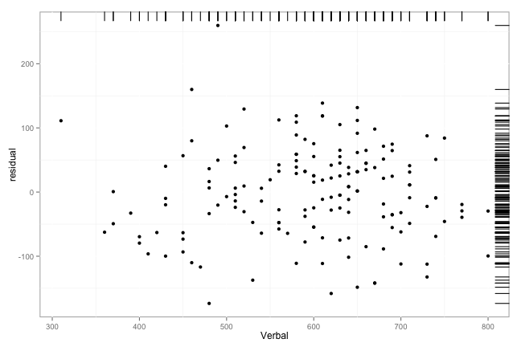 


In an attempt to show the relationship between the predicted value and the residuals, this figures combines both the basic scatter plot with the residuals. Each Math score is connected with the corresponding residual point.

```r
ggplot(sat, aes(x=Verbal, y=Math)) + geom_point(color='black', size=3) +
	geom_point(aes(x=Verbal, y=residual), color='blue', size=3) +
	geom_abline(intercept=b, slope=m, color='red', size=2, alpha=.5) +
	geom_segment(aes(xend=Verbal, yend=residual), alpha=.1) +
	geom_hline(yintercept=0) + geom_rug(aes(y=residual), color='blue', sides='rb')
```

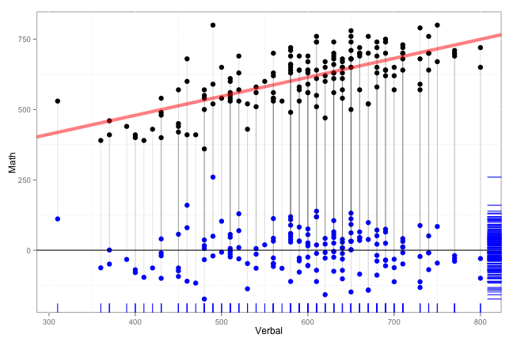 


Histogram of residuals.

```r
ggplot(sat, aes(x=residual)) + geom_histogram(alpha=.5, binwidth=25)
```

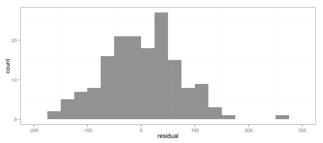 


Calculate ${R}^{2}$

```r
r^2
```

```
[1] 0.469
```


Now we can predict Math scores from new Verbal.

```r
newX <- 550
(newY <- newX * m + b)
```

```
[1] 581
```


```r
ggplot(sat, aes(x=Verbal, y=Math)) + geom_point(color='black') +
	geom_abline(intercept=b, slope=m, color='red', size=2, alpha=.5) +
	geom_point(x=newX, y=newY, shape=17, color='darkgreen', size=8)
```

 


## Using R's built in functionality for linear modeling

The `lm` function in R will calculate everything above for us in one command.

```r
sat.lm <- lm(Math ~ Verbal, data = sat)
sat.lm
```

```

Call:
lm(formula = Math ~ Verbal, data = sat)

Coefficients:
(Intercept)       Verbal  
    209.554        0.675  
```

```r
summary(sat.lm)
```

```

Call:
lm(formula = Math ~ Verbal, data = sat)

Residuals:
    Min      1Q  Median      3Q     Max 
-173.59  -47.60    1.16   45.09  259.66 

Coefficients:
            Estimate Std. Error t value Pr(>|t|)    
(Intercept) 209.5542    34.3494     6.1  7.7e-09 ***
Verbal        0.6751     0.0568    11.9  < 2e-16 ***
---
Signif. codes:  0 '***' 0.001 '**' 0.01 '*' 0.05 '.' 0.1 ' ' 1

Residual standard error: 71.8 on 160 degrees of freedom
Multiple R-squared:  0.469,	Adjusted R-squared:  0.465 
F-statistic:  141 on 1 and 160 DF,  p-value: <2e-16
```


We can get the predicted values and residuals from the `lm` function

```r
sat.lm.predicted <- predict(sat.lm)
sat.lm.residuals <- resid(sat.lm)
```


Confirm that they are the same as what we calculated above.

```r
head(cbind(sat.lm.predicted, sat$Math.predicted))
```

```
  sat.lm.predicted    
1              513 513
2              642 642
3              608 608
4              480 480
5              615 615
6              621 621
```

```r
head(cbind(sat.lm.residuals, sat$residual))
```

```
  sat.lm.residuals       
1            -63.3  -63.3
2           -101.6 -101.6
3            -37.8  -37.8
4            -79.6  -79.6
5            -24.6  -24.6
6            -11.3  -11.3
```


## Re-evaluating the Residuals -- Implications for Grouping Variables.

First, let's look at the scatter plot but with a gender indicator.


```r
ggplot(sat, aes(x=Verbal, y=Math, color=Sex, shape=Sex)) + 
	geom_point(size=2.5) + 
	scale_color_manual(limits=c('M','F'), values=c('blue','maroon')) +
	scale_shape_manual(limits=c('M','F'), values=c(16, 17))
```

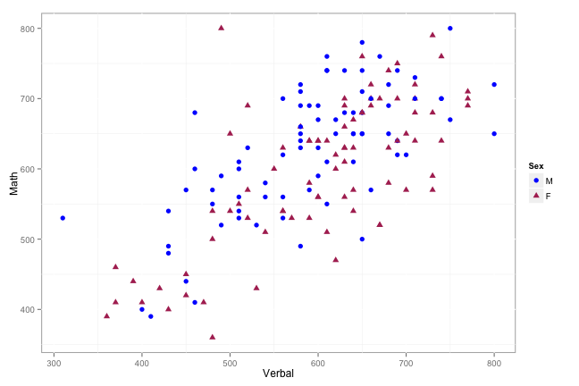 


And also the residual plot with an indicator for gender.


```r
ggplot(sat) + 
	geom_point(aes(x=Verbal, y=residual, color=Sex, shape=Sex), size=2.5) + 
	scale_color_manual(limits=c('M','F'), values=c('blue','maroon')) +
	scale_shape_manual(limits=c('M','F'), values=c(16, 17)) + 
	geom_rug(data=subset(sat, Sex=='M'), aes(y=residual, color=Sex), sides='tr') +
	geom_rug(data=subset(sat, Sex=='F'), aes(y=residual, color=Sex), sides='lb')
```

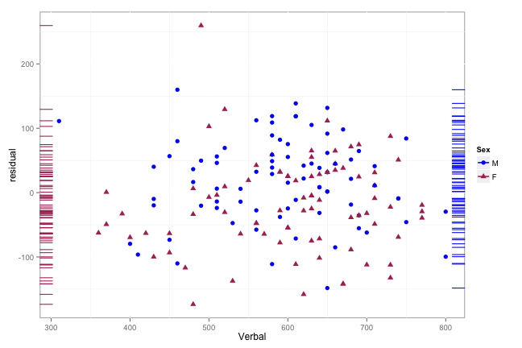 


The histograms also show that the distribution are different across gender.

```r
ggplot(sat, aes(x=residual)) + geom_histogram(binwidth=25, alpha=.5) + facet_wrap(~ Sex, ncol=1)
```

 


Upon careful examination of these two figures, there is some indication there may be a difference between genders. In the scatter plot, it appears that there is a cluster of males towoards the top left and a cluster of females towards the right. The residual plot also shows a cluster of males on the upper left of the cluster as well as a cluster of females to the lower right. Perhaps estimating two separate models would be more appropriate.

To start, we create two data frames for each gender.


```r
sat.male <- sat[sat$Sex == "M", ]
sat.female <- sat[sat$Sex == "F", ]
```


Calculate the mean for Math and Verbal for both males and females.


```r
(male.verbal.mean <- mean(sat.male$Verbal))
```

```
[1] 590
```

```r
(male.math.mean <- mean(sat.male$Math))
```

```
[1] 627
```

```r
(female.verbal.mean <- mean(sat.female$Verbal))
```

```
[1] 602
```

```r
(female.math.mean <- mean(sat.female$Math))
```

```
[1] 598
```


Estimate two linear models for each gender.


```r
sat.male.lm <- lm(Math ~ Verbal, data = sat.male)
sat.female.lm <- lm(Math ~ Verbal, data = sat.female)
sat.male.lm
```

```

Call:
lm(formula = Math ~ Verbal, data = sat.male)

Coefficients:
(Intercept)       Verbal  
    250.145        0.638  
```

```r
sat.female.lm
```

```

Call:
lm(formula = Math ~ Verbal, data = sat.female)

Coefficients:
(Intercept)       Verbal  
    158.996        0.729  
```


We do in fact find that the intercepts and slopes are both fairly different. The figure below adds the regression lines to the scatter plot.


```r
ggplot(sat, aes(x=Verbal, y=Math, color=Sex)) + 
	geom_point(size=2.5) +
	geom_vline(xintercept=male.verbal.mean, color='blue') +
	geom_hline(yintercept=male.math.mean, color='blue') +
	geom_vline(xintercept=female.verbal.mean, color='maroon') +
	geom_hline(yintercept=female.math.mean, color='maroon') +
	geom_abline(slope=sat.male.lm$coefficients[2], 
				intercept=sat.male.lm$coefficients[1], color='blue', size=2, alpha=.5) +
	geom_abline(slope=sat.female.lm$coefficients[2], 
				intercept=sat.female.lm$coefficients[1], color='maroon', size=2, alpha=.5) +
	geom_abline(intercept=b, slope=m, color='red', size=1, alpha=.5) +
	scale_color_manual(limits=c('M','F'), values=c('blue','maroon'))
```

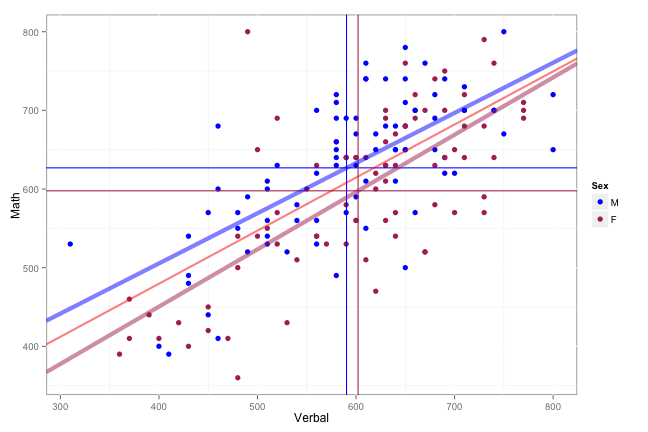 


Let's compare the $R^2$ for the three models.


```r
cor(sat$Verbal, sat$Math)^2
```

```
[1] 0.469
```

```r
cor(sat.male$Verbal, sat.male$Math)^2
```

```
[1] 0.471
```

```r
cor(sat.female$Verbal, sat.female$Math)^2
```

```
[1] 0.514
```


The $R^2$ for the full model accounts for approximately 46.9% of the variance. By estimating separate models for each gender we can account for 47.1% and 51.4% of the variance for males and females, respectively.

## Examining Possible Outliers

Re-examining the histogram of residuals, there is one data point with a residual higher than the rest. This is a possible outlier. In this section we'll examine how that outlier may impact our linear model.


```r
ggplot(sat, aes(x=residual, fill=residual > 200)) + 
	geom_histogram(alpha=.5, binwidth=25) +
	scale_fill_manual(limits=c(TRUE, FALSE), values=c('red','black'))
```

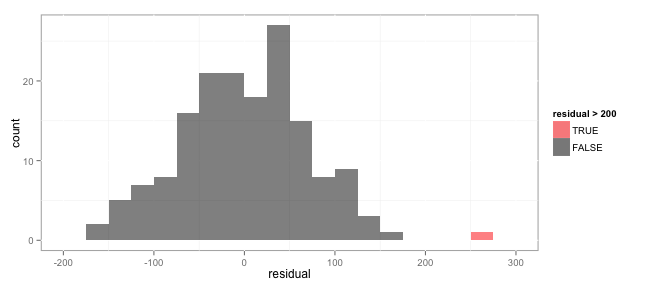 


We can extract that record from our data frame. We can also highlight that point on the scatter plot.


```r
sat.outlier <- sat[sat$residual > 200, ]
sat.outlier
```

```
    Verbal Math Sex Verbal.z Math.z Math.predicted residual predicted.bad
162    490  800   F    -1.07   1.91            540      260           561
```


```r
ggplot(sat, aes(x=Verbal, y=Math)) + 
	geom_point(size=2.5) +
	geom_point(x=sat.outlier$Verbal, y=sat.outlier$Math, color='red', size=2.5, shape=17) +
	geom_abline(intercept=b, slope=m, color='red', size=2, alpha=.5)
```

 


We see that excluding this point changes model slightly. With the outlier included we can account for 45.5% of the variance and by excluding it we can account for 47.9% of the variance. Although excluding this point improves our model, this is an insufficient enough reason to do so. Further explenation is necessary.


```r
(sat.lm <- lm(Math ~ Verbal, data = sat))
```

```

Call:
lm(formula = Math ~ Verbal, data = sat)

Coefficients:
(Intercept)       Verbal  
    209.554        0.675  
```

```r
(sat.lm2 <- lm(Math ~ Verbal, data = sat[sat$residual < 200, ]))
```

```

Call:
lm(formula = Math ~ Verbal, data = sat[sat$residual < 200, ])

Coefficients:
(Intercept)       Verbal  
    197.470        0.693  
```

```r
sat.lm$coefficients[2]^2
```

```
Verbal 
 0.456 
```

```r
sat.lm2$coefficients[2]^2
```

```
Verbal 
  0.48 
```


## More outliers

For the following two examples, we will add outliers to examine how they would effect our models. In the first example, we will add an outlier that is close to our fitted model (i.e. a small residual) but lies far away from the cluster of points. As we can see below, this single point increases our $R^2$ by more than 5%.

```r
outX <- 1200
outY <- 1150
sat.outlier <- rbind(sat[, c("Verbal", "Math")], c(Verbal = outX, Math = outY))
(sat.lm <- lm(Math ~ Verbal, data = sat))
```

```

Call:
lm(formula = Math ~ Verbal, data = sat)

Coefficients:
(Intercept)       Verbal  
    209.554        0.675  
```

```r
(sat.lm2 <- lm(Math ~ Verbal, data = sat.outlier))
```

```

Call:
lm(formula = Math ~ Verbal, data = sat.outlier)

Coefficients:
(Intercept)       Verbal  
    186.372        0.715  
```


```r
ggplot(sat.outlier, aes(x=Verbal, y=Math)) + 
	geom_point(size=2.5) +
	geom_point(x=outX, y=outY, color='red', size=2.5, shape=17) +
	geom_abline(intercept=b, slope=m, color='red', size=2, alpha=.5) +
	geom_abline(intercept=sat.lm2$coefficients[1], slope=sat.lm2$coefficients[2], 
				size=2, alpha=.5)
```

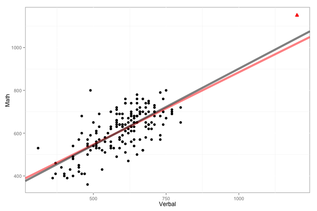 


```r
unname(sat.lm$coefficients[2]^2)
```

```
[1] 0.456
```

```r
unname(sat.lm2$coefficients[2]^2)
```

```
[1] 0.511
```


Outliers can have the opposite effect too. In this example, our $R^2$ is decreased by almost 16%.

```r
outX <- 300
outY <- 1150
sat.outlier <- rbind(sat[, c("Verbal", "Math")], c(Verbal = outX, Math = outY))
(sat.lm <- lm(Math ~ Verbal, data = sat))
```

```

Call:
lm(formula = Math ~ Verbal, data = sat)

Coefficients:
(Intercept)       Verbal  
    209.554        0.675  
```

```r
(sat.lm2 <- lm(Math ~ Verbal, data = sat.outlier))
```

```

Call:
lm(formula = Math ~ Verbal, data = sat.outlier)

Coefficients:
(Intercept)       Verbal  
    290.891        0.546  
```


```r
ggplot(sat.outlier, aes(x=Verbal, y=Math)) + 
	geom_point(size=2.5) +
	geom_point(x=outX, y=outY, color='red', size=2.5, shape=17) +
	geom_abline(intercept=b, slope=m, color='red', size=2, alpha=.5) +
	geom_abline(intercept=sat.lm2$coefficients[1], slope=sat.lm2$coefficients[2], 
				size=2, alpha=.5)
```

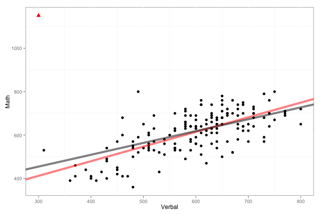 

```r
unname(sat.lm$coefficients[2] ^ 2)
```

```
[1] 0.456
```

```r
unname(sat.lm2$coefficients[2] ^ 2)
```

```
[1] 0.298
```


<!-- MathJax: Fall back to local if CDN offline but local image fonts are not supported (saves >100MB) -->
<script type="text/x-mathjax-config">
  MathJax.Hub.Config({
    tex2jax: {
      inlineMath: [['$','$'], ['\\(','\\)']],
      processEscapes: true
    }
  });
</script>
<script type="text/javascript" src="http://cdn.mathjax.org/mathjax/2.0-latest/MathJax.js?config=TeX-AMS-MML_HTMLorMML"></script>
<!-- <script src="https://c328740.ssl.cf1.rackcdn.com/mathjax/2.0-latest/MathJax.js?config=TeX-AMS-MML_HTMLorMML">
</script> -->
<script>window.MathJax || document.write('<script type="text/x-mathjax-config">MathJax.Hub.Config({"HTML-CSS":{imageFont:null}});<\/script><script src="libraries/widgets/mathjax/MathJax.js?config=TeX-AMS-MML_HTMLorMML"><\/script>')
</script>

